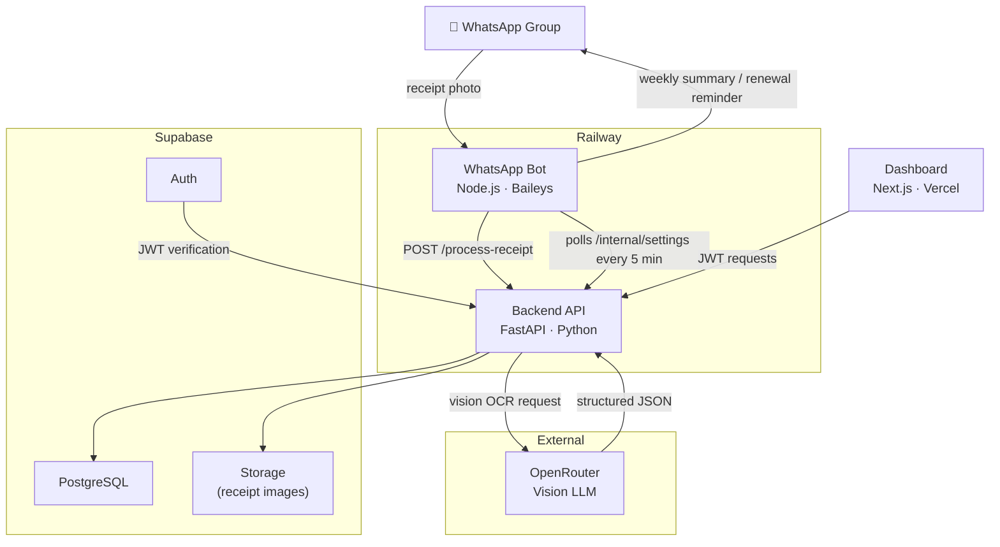

# Homly

Homly is a **family operating system** — a platform that brings together the financial and administrative life of a household into one place, meeting families where they already are: WhatsApp.

The first module is expense tracking. Household members photograph receipts in a shared WhatsApp group; the bot OCR-analyses them, stores structured data, and delivers weekly summaries back to the group. A web dashboard covers spending analytics, reimbursements, insurance policy management, and bot configuration. The architecture is intentionally modular — built to grow new modules (tasks, documents, calendars, etc.) on top of the same multi-tenant shell.

**[Live demo →](https://homly-six.vercel.app)** · [How AI is used](AI.md) · [Roadmap](ROADMAP.md)

> Demo credentials available on request.

---

## Modules

### Expenses
- **WhatsApp receipt capture** — photo a receipt in the group; the bot OCRs and categorises it automatically
- **Structured line items** — vendor, total, tax, individual items, categories (groceries, transport, F&B, etc.)
- **Weekly summaries** — scheduled digest sent to the WhatsApp group with category totals and flagged receipts
- **Dashboard** — this week's spending, full transaction history, analytics by category and vendor
- **Reimbursement tracking** — mark receipts as reimbursable and track outstanding amounts
- **Price intelligence** — cross-household item price comparison and trends (super-admin)

### Insurance
- **Policy manager** — store policies with provider, coverage type, premium, and renewal date
- **Renewal reminders** — bot proactively messages the group at 30 days and 7 days before renewal

### Platform
- **Multi-household** — one backend serves multiple households; all data is strictly isolated by `household_id`
- **Invite system** — admins invite members by email; role-based access (admin / member)
- **Extensible shell** — two-level nav (rail + subnav) designed to accommodate new modules without layout changes

---

## Stack

| Layer | Technology |
|-------|-----------|
| Frontend | Next.js 14, React, TypeScript, Tailwind CSS |
| Backend | FastAPI, Python 3.11 |
| Database | Supabase (PostgreSQL + Auth + Storage) |
| WhatsApp bot | Node.js, Baileys (WA multi-device) |
| LLM (vision) | OpenRouter (vision model for receipt OCR) |
| Hosting | Vercel (frontend) · Railway (backend + bot) |

---

## Architecture



The bot maintains a `groupJid → household` map to route incoming messages to the right tenant. A per-household cron delivers weekly expense summaries and insurance renewal reminders back to each WhatsApp group.

---

## Project Structure

```
homly/
├── backend/
│   ├── api/
│   │   ├── main.py                  # FastAPI app, CORS, router mounting
│   │   ├── middleware/auth.py        # Supabase JWT + service key auth
│   │   └── routers/
│   │       ├── expenses.py          # Receipt ingestion + week queries
│   │       ├── households.py        # Members, invites
│   │       ├── settings.py          # Household settings
│   │       ├── insurance.py         # Insurance policies + renewal endpoint
│   │       ├── setup.py             # WhatsApp QR flow (SSE)
│   │       ├── messages.py          # Queued WhatsApp messages
│   │       └── internal.py          # Bot ↔ backend internal endpoints
│   ├── agents/receipt_agent.py      # Vision LLM → structured receipt JSON
│   ├── services/llm_client.py       # OpenRouter facade
│   ├── migrations/                  # Numbered SQL migrations (run manually in Supabase)
│   └── requirements.txt
├── frontend/
│   ├── config/apps.ts               # Navigation config (single source of truth)
│   ├── app/
│   │   ├── (shell)/                 # Auth-guarded shell layout
│   │   │   ├── expenses/            # Overview, Transactions, Members, Summary, Insights
│   │   │   ├── insurance/           # Policies list, Renewals countdown
│   │   │   ├── admin/               # Super-admin: households, invites, price intelligence
│   │   │   ├── settings/page.tsx    # Household settings + WhatsApp config
│   │   │   └── setup/page.tsx       # QR scan + group selection
│   │   └── components/shell/        # Rail, Subnav, Topbar, BottomTabBar
│   └── lib/
│       ├── supabase.ts
│       └── axios.ts                 # Shared axios with JWT interceptor
│   └── whatsapp/
│       ├── index.js                 # Bot: QR connect, receipt processing, crons
│       └── package.json
```

---

## Local Development

### Prerequisites

- Node.js 18+
- Python 3.11+
- A [Supabase](https://supabase.com) project (free tier)
- An [OpenRouter](https://openrouter.ai) API key

### 1. Database

In the Supabase SQL Editor, run the migration files in order:

```
backend/migrations/001_homly.sql
backend/migrations/002_soft_delete.sql
...through...
backend/migrations/015_insurance_policies.sql
```

### 2. Backend

```bash
cd backend
pip install -r requirements.txt

# Create backend/.env
SUPABASE_URL=https://yourproject.supabase.co
SUPABASE_KEY=your_service_role_key
SUPABASE_JWT_SECRET=your_jwt_secret
OPENROUTER_API_KEY=your_openrouter_key
INTERNAL_KEY=homly-internal

uvicorn api.main:app --reload --port 8000
```

### 3. WhatsApp Bot

```bash
cd backend/whatsapp
npm install

# Create backend/whatsapp/.env
FASTAPI_URL=http://localhost:8000
SUPABASE_URL=https://yourproject.supabase.co
SUPABASE_KEY=your_service_role_key
INTERNAL_KEY=homly-internal

npm start
# Scan the QR code in your terminal with WhatsApp → Linked Devices → Link a Device
```

### 4. Frontend

```bash
cd frontend
npm install

# Create frontend/.env.local
NEXT_PUBLIC_SUPABASE_URL=https://yourproject.supabase.co
NEXT_PUBLIC_SUPABASE_ANON_KEY=your_supabase_anon_key
NEXT_PUBLIC_API_URL=http://localhost:8000

npm run dev
# Open http://localhost:3000
```

---

## Deployment

### Backend + Bot → Railway

1. Create two Railway services from the same repo:
   - **FastAPI**: root `backend/`, start command `uvicorn api.main:app --host 0.0.0.0 --port $PORT`
   - **WhatsApp bot**: root `backend/whatsapp/`, start command `npm start`
2. Add env variables to each service; set the bot's `FASTAPI_URL` to the FastAPI Railway URL
3. First run: open Railway logs for the bot service and scan the QR code

### Frontend → Vercel

1. Import the repo, set root directory to `frontend/`
2. Add env variables (`NEXT_PUBLIC_SUPABASE_URL`, `NEXT_PUBLIC_SUPABASE_ANON_KEY`, `NEXT_PUBLIC_API_URL`)
3. Update CORS in `backend/api/main.py` to include your Vercel deployment URL

---

## Estimated Running Cost

| Service | Cost |
|---------|------|
| Railway (backend + bot) | ~$5/month |
| Supabase | Free tier |
| Vercel | Free tier |
| OpenRouter (vision OCR) | ~$0.10/month (≈20 receipts/week) |
| **Total** | **~$5/month** |

---

## Authentication

- **Users** — Supabase JWT; the frontend attaches it as `Authorization: Bearer` on every request
- **WhatsApp bot** — uses the Supabase service role key (never expires); endpoints read `household_id` from the request body/query param
- **Internal endpoints** (`/internal/*`, `/setup/*`) — validated via `X-Internal-Key` header, not JWT
