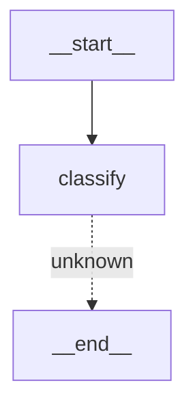

# Task 020 — LangGraph Integration

## State Shape (`HomlyState`)

| Field | Type | Why it exists |
|-------|------|---------------|
| `household_id` | `str` | Every query is scoped to a household; all DB reads/writes use this as the partition key. |
| `group_jid` | `Optional[str]` | WhatsApp group JID — needed so nodes that send messages back know where to deliver them. |
| `query` | `Optional[str]` | Raw text from a WhatsApp message or API call; populated when the trigger is a text message. |
| `image_bytes` | `Optional[bytes]` | Raw image payload; populated when the trigger is an image (receipt or recipe photo). |
| `image_mime` | `Optional[str]` | MIME type of the image (e.g. `image/jpeg`) — required by the vision model API. |
| `message_type` | `Optional[str]` | Classification output: `"receipt"`, `"recipe"`, `"text_query"`, `"pantry_command"`, `"unknown"`. Drives conditional routing after `classify`. |
| `agent_results` | `Annotated[list, add]` | Reducer-merged list so multiple parallel agent nodes can each append their output without overwriting each other. |
| `response` | `Optional[str]` | Final WhatsApp-ready text assembled by `synthesise`. The bot sends this string to the group. |
| `context` | `Optional[list]` | Last N conversation turns stored as `[{role, content}]` pairs; passed to the LLM for follow-up queries. |
| `error` | `Optional[str]` | Non-fatal error description; `synthesise` can fall back to a user-friendly message when set. |

---

## Planned Node Structure

```
__start__
    │
    ▼
┌─────────┐
│ classify │  LLM or heuristic → sets message_type
└────┬────┘
     │
     ├─── "receipt"        ──► receipt_agent  ──► synthesise ──► __end__
     ├─── "recipe"         ──► recipe_agent   ──► synthesise ──► __end__
     ├─── "text_query"     ──► query_agent    ──► synthesise ──► __end__
     ├─── "pantry_command" ──► pantry_agent   ──► synthesise ──► __end__
     └─── "unknown"        ──────────────────────────────────► __end__
```

### Phase A (current) — Scaffolding
- `HomlyState` defined.
- `classify_node` stub: always returns `message_type = "unknown"`.
- `synthesise_node` stub: returns `response = "stub response"`.
- Graph compiles and routes `unknown` → `END` without touching `synthesise`.

### Phase B — Classifier
- Replace `classify_node` stub with an LLM call (or fast heuristic) that inspects `query` / presence of `image_bytes` and sets `message_type`.
- Add conditional edges for all five message types.

### Phase C — Agent Nodes
- Implement `receipt_agent`, `recipe_agent`, `query_agent`, `pantry_agent` nodes.
- Each appends a structured dict to `agent_results`.
- Wire all into graph with edges to `synthesise`.

### Phase D — Synthesise
- Replace `synthesise_node` stub with a node that reads `agent_results` and formats a WhatsApp-friendly reply into `response`.

### Phase E — API Integration
- Mount `graph.invoke()` inside the FastAPI receipt/message flow.
- Optionally add Postgres checkpointer for conversation memory.

---

## Graph Diagram (Phase A)



`synthesise` is defined but unreachable until Phase B wires in the other message-type edges.
